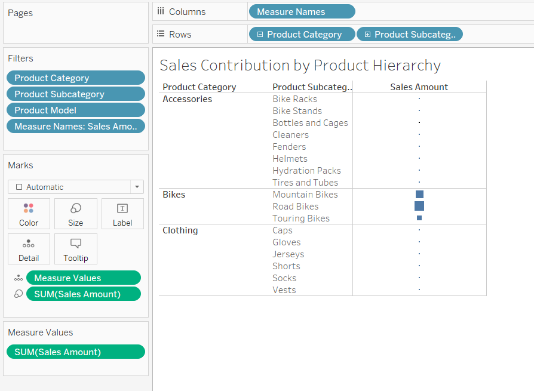

#Data Visualization using Tableau

Tableau version used: 10.4

DataSource: SQL Server database AdventureWorksDW2014 Internet Sales and views

The SalesReport.twbx file gives analysis reports, dashboards and story of Internet Sales by Adventure Works 2014.

##Analysis 1

Product Hierarchy Contribution of Sales

This analysis depicts total sales contribution by Product Hierarchy (Product Name, Product Category, Product SubCategory)

##Analysis 2

Comparison of Internet Sales Amount in all the Months of 2014, 2015 and 2016

##Analysis 3

This analysis depicts total sales contribution by Geography Hierarchy (Country Rgion, State, City, Postal Code) on Symbol Maps

##Analysis 4

This analysis depicts Product Sales by Geography (Product Hierarchy by Geo Hierarchy)

##Analysis 5

Amount of Profit made by Sales Terrioty group and Country is depicted in this visualization

##Analysis 6

Below are the names of top 20 customers of internet sales

##Analysis 7

Shows the effect of Education ans Occuption of Customers over the Internet Sales

##DashBoard

The following dashboard can collectively show internet sales by adventure works in a glance with respect to Product Hierarchy, Geo Hierarchy, Sales Profit and effect of Customer's education and profession over the Total Internet Sales

##Story
I create a story using this beautiful visualization tool 'Tableau' which gives me the entire gist of how Internet Sales differ over Products, Geography and Time Period

This analysis can make us conclude that Road Bikes were highly sold over Internet in December 2016 in the State of CA, United States
